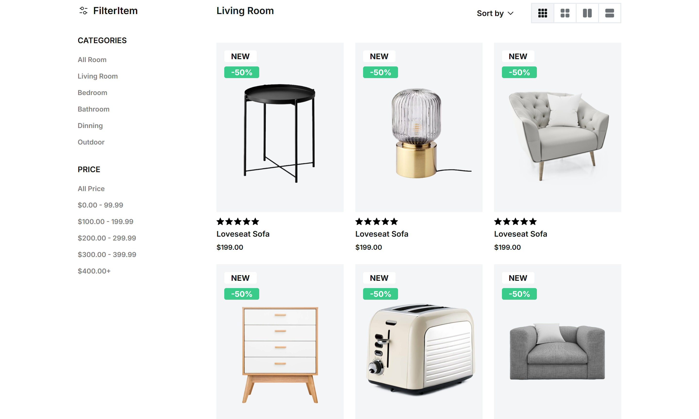

#  Hi there, I'm *Naji Aljarwan*

- Frontend-focused developer building structured, user-centered web applications
- Currently focused on improving frontend architecture, performance, and UI design systems
- Expanding expertise toward full-stack and application development roles

  

## 🚀 Featured Projects

<table>
  <tr>
    <td>Project</td>
    <td>Description</td>
    <td>Tech Stack & Tools</td>
    <td>Live Demo</td>
  </tr>
  <tr>
    <td><a href="https://github.com/najialjarwan/ma7ali">Ma7ali <strong>(Full-Stack)</strong></a></td>
    <td>POS PWA for managing small businesses</td>
  <td>
    
    
    
    
    
    
    
  </td>
  <td>N/A</td>
  </tr>
  <tr>
    <td><a href="https://github.com/najialjarwan/3legant">3legant <strong>(Front-End)</strong></a></td>
    <td>Modular e-commerce architecture</td>
    <td>
      
      
      
      
      
      
      
      
      
      
    </td>
    <td>Coming Soon</td>
  </tr>
  <tr>
    <td><a href="https://github.com/najialjarwan/fitnesso">Github README Generator <strong>(Tool)</strong></a></td>
    <td>CLI tool for generating structured GitHub README files</td>
    <td>
      
      
      
      
    </td>
    <td>N/A</td>
  </tr>
</table>

## ⭐ Project Highlight
- UI implemented from 3legant Figma design
- Focus of the project was building a modular React architecture and reusable components

  

## 🛠️ Techs & Tools

<table>
  <tr>
    <td><strong>Proficient in</strong></td>
    <td>
      &nbsp;
      &nbsp;
      &nbsp;
      &nbsp;
      &nbsp;&nbsp;&nbsp;&nbsp;&nbsp;&nbsp;&nbsp;&nbsp;&nbsp;&nbsp;&nbsp;&nbsp;&nbsp;&nbsp;&nbsp;&nbsp;&nbsp;&nbsp;&nbsp;&nbsp;&nbsp;&nbsp;&nbsp;&nbsp;&nbsp;&nbsp;&nbsp;&nbsp;&nbsp;&nbsp;&nbsp;&nbsp;&nbsp;&nbsp;&nbsp;&nbsp;&nbsp;&nbsp;&nbsp;&nbsp;&nbsp;&nbsp;&nbsp;&nbsp;&nbsp;&nbsp;&nbsp;&nbsp;&nbsp;&nbsp;&nbsp;&nbsp;&nbsp;&nbsp;&nbsp;&nbsp;
    </td>
  </tr>
  <tr>
    <td><strong>Experienced With</strong></td>
    <td>
      &nbsp;
      &nbsp;
      &nbsp;
      &nbsp;
    </td>
  </tr>
  <tr>
    <td><strong>Familiar With</strong></td>
    <td>
      &nbsp;
      &nbsp;
      &nbsp;
    </td>
  </tr>
  <tr>
    <td><strong>Tools</strong></td>
    <td>
      &nbsp;
      &nbsp;
      &nbsp;
      &nbsp;
      &nbsp;
      &nbsp;
      &nbsp;
      &nbsp;
    </td>
  </tr>
</table>

## 🌍 About Me

- 22 years old, Born in **Syria**, currently based in **Lebanon**
- I speak English, Arabic and I'm currently learning Spanish
- Computer Science graduate
- Fast typist (~150 WPM)
- Interested in building thoughtful digital products

<!-- 

  

  

 -->

## 🤝 Connect with me

  &nbsp;&nbsp;
  &nbsp;&nbsp;
  &nbsp;&nbsp;
  &nbsp;&nbsp;
  &nbsp;&nbsp;
  &nbsp;&nbsp;

---

Feel free to explore my repositories

